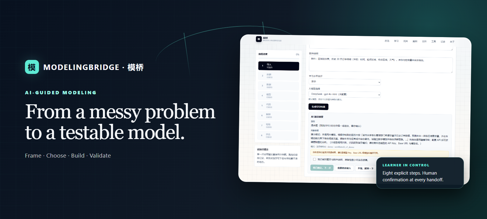
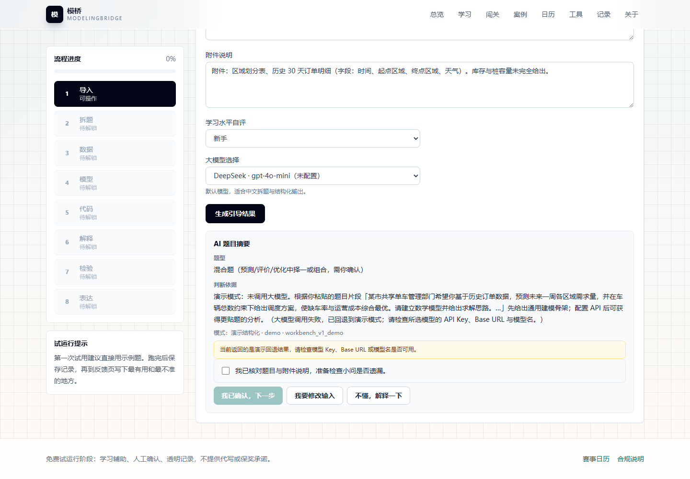
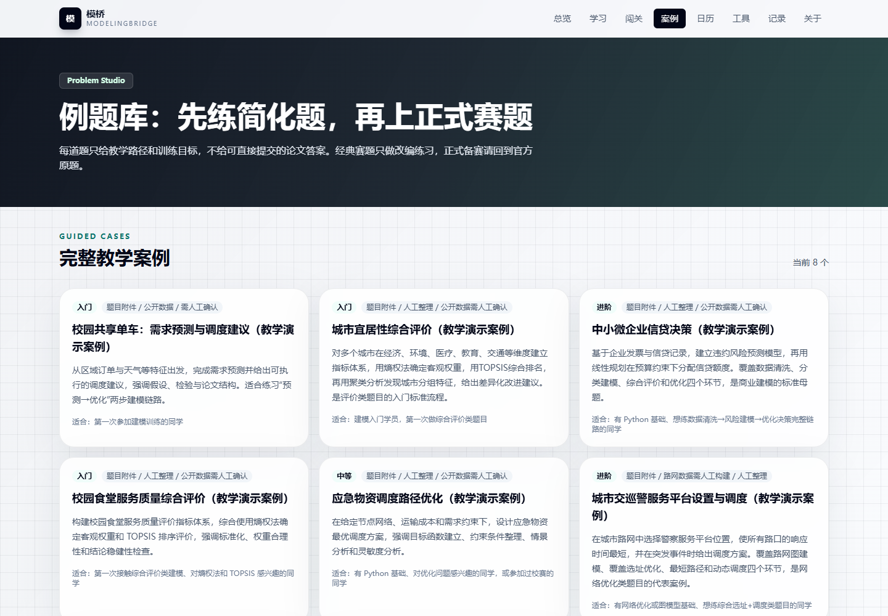
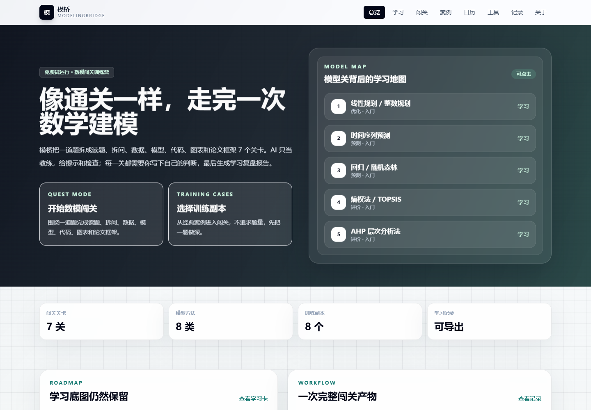
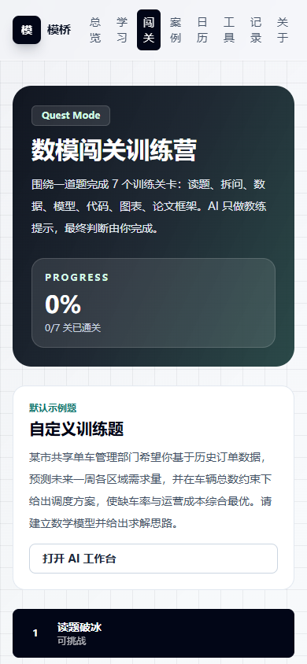
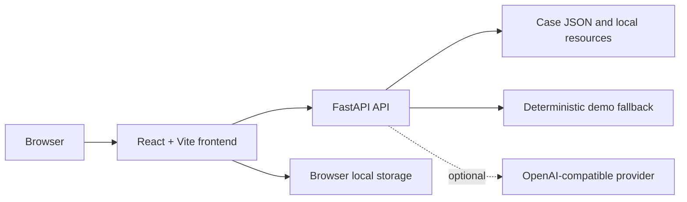

# ModelingBridge



<p align="center">
  <a href="README.zh-CN.md">简体中文</a> ·
  <a href="https://modelingbridge.vercel.app">Live Demo</a>
</p>

<p align="center">
  
  
  
  
</p>

ModelingBridge (模桥) is an AI-guided mathematical modeling learning platform for beginners. It turns an open-ended problem into a sequence of decisions the learner can inspect, confirm, and revise—from framing and data requirements to model selection, implementation, validation, and paper structure.

> The public demo is currently a trial deployment. The repository also runs locally without model credentials by using deterministic demo output.

## Learn modeling as a process

ModelingBridge is built around a simple belief: learning modeling means practicing judgment, not receiving a finished paper. The interface makes the reasoning path visible, asks the learner to confirm each stage, and keeps AI in a coaching role.

The current product includes:

- a seven-checkpoint quest for deliberate practice;
- an eight-step AI workbench for problem-to-paper scaffolding;
- eight guided cases and a searchable modeling-method map;
- local learning records, exportable summaries, tools, resources, and a contest calendar;
- explicit reminders to verify data, assumptions, constraints, and conclusions.

## Guided workflow

| Stage | Learner output |
| --- | --- |
| Frame | Goals, constraints, subproblems, and expected deliverables |
| Choose | Candidate model families with assumptions and trade-offs |
| Build | Data fields, preprocessing plan, and an implementation scaffold |
| Validate | Error, robustness, sensitivity, and constraint checks |
| Communicate | A paper outline and traceable learning notes—not a submitted paper |

## Features

- **Quest mode** — complete a modeling problem through seven learner-owned checkpoints.
- **Guided workbench** — move through import, task framing, data, model, code, interpretation, validation, and writing.
- **Case library** — study eight teaching cases without presenting them as official contest solutions.
- **Method map** — connect recommendations to beginner-friendly cards for optimization, forecasting, evaluation, and simulation methods.
- **Provider-aware AI** — use configured DeepSeek, MiMo, or another OpenAI-compatible endpoint; fall back to deterministic demo output when credentials are absent or a request fails.
- **Local progress** — quest state and learning records remain in browser storage unless you export or clear them.

## Screenshots

| Guided workbench | Case library |
| --- | --- |
|  |  |

| Home | Mobile quest |
| --- | --- |
|  |  |

Screenshots were captured from the local application with repository-provided demo content and no model credentials or personal records.

## Architecture



The frontend proxies `/api` to FastAPI during local development. In production, set `VITE_API_BASE_URL` to the deployed API origin.

## Quick start

Requirements: Node.js LTS and Python 3.11+.

1. Start the backend:

   ```bash
   cd backend
   python -m venv .venv
   # Windows: .venv\Scripts\activate
   # macOS/Linux: source .venv/bin/activate
   pip install -r requirements.txt
   uvicorn app.main:app --reload --host 127.0.0.1 --port 8000
   ```

2. In another terminal, start the frontend:

   ```bash
   cd frontend
   npm ci
   npm run dev
   ```

3. Open `http://127.0.0.1:5173`. The health endpoint is `http://127.0.0.1:8000/api/health`.

On Windows, `启动后端.bat` and `启动前端.bat` provide the same two-process setup.

## Configuration

The backend works without an API key. For live model output, create `backend/.env` and configure an OpenAI-compatible provider:

```dotenv
LLM_PROVIDER=deepseek
LLM_API_KEY=your_key_here
LLM_BASE_URL=https://api.deepseek.com/v1
LLM_MODEL=deepseek-chat
```

Optional deployment settings:

| Variable | Purpose |
| --- | --- |
| `BACKEND_CORS_ORIGINS` | Comma-separated frontend origins allowed by FastAPI |
| `VITE_API_BASE_URL` | Public backend origin used by the Vite build |
| `TRIAL_ACCESS_CODE` / `VITE_TRIAL_ACCESS_CODE` | Lightweight trial gate; not a production authentication system |

Never commit `.env` files or real credentials. Model prompts and submitted problem text are sent to the configured provider only when a live provider is selected and available.

## Testing

Frontend:

```bash
cd frontend
npm ci
npm test
npm run build
```

Backend development dependencies and tests:

```bash
cd backend
python -m venv .venv
# activate the environment first
pip install -r requirements-dev.txt
python -m pytest tests -q
```

Some resource-root tests expect the optional, gitignored local archives documented by the resource module. The web app itself skips archive roots that are not present.

## Deployment

- **Frontend:** Vercel, with `frontend/` as the root and `dist/` as the output directory.
- **Backend:** Render, using the repository's [`render.yaml`](render.yaml).
- **Guide:** see [`docs/deploy-vercel-render.md`](docs/deploy-vercel-render.md).

## Responsible AI and learning boundaries

ModelingBridge is a learning aid, not an answer-submission service. Learners remain responsible for data provenance, mathematical assumptions, code correctness, validation, citations, and final writing. Generated suggestions can be incomplete or wrong; verify them before using them in academic work or decisions.

Bundled cases are teaching examples. External archives and source materials are intentionally excluded from Git and retain their original rights and provenance.

## Roadmap

- Make resource provenance and optional archive setup easier to inspect.
- Add stronger end-to-end coverage for the frontend/backend learning loop.
- Improve accessible mobile navigation and export formats.
- Expand case authoring without turning the library into an answer bank.

## License

Code in this repository is available under the [MIT License](LICENSE). Third-party learning materials and external archives are not relicensed by this repository.
