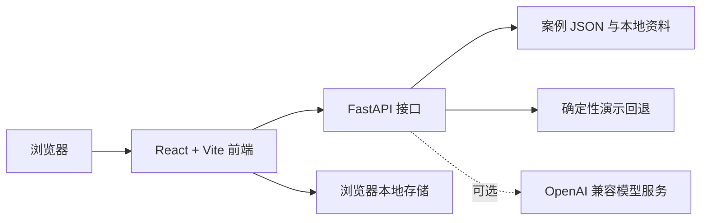

# ModelingBridge · 模桥


<p align="center">
  <a href="README.md">English</a> ·
  <a href="https://modelingbridge.vercel.app">在线体验</a>
</p>

<p align="center">
  
  
  
  
</p>

ModelingBridge（模桥）是一款面向数学建模初学者的 AI 引导式学习平台。它把开放题拆成一条可检查、可确认、可修改的决策链：从问题定义和数据需求，一直走到模型选择、代码实践、结果检验与论文结构。

> 在线地址目前是试用部署；即使不配置模型密钥，本地应用也能通过确定性的演示结果跑通主要流程。

## 把建模当作一个过程来学

ModelingBridge 的核心不是替你写完论文，而是训练判断。界面把推理路径显式呈现出来，要求学习者逐步确认，并把 AI 限定在教练和检查者的位置。

当前产品包括：

- 7 个关卡组成的刻意练习流程；
- 从题目到论文框架的 8 步 AI 工作台；
- 8 个教学案例与可检索的建模方法地图；
- 本地学习记录、可导出摘要、工具箱、资料入口与赛事日历；
- 对数据、假设、约束和结论进行人工核验的明确提醒。

## 引导式工作流

| 阶段 | 学习者产出 |
| --- | --- |
| 定义 | 目标、约束、子问题和交付形式 |
| 选择 | 候选模型、适用假设与取舍 |
| 构建 | 数据字段、预处理计划和代码骨架 |
| 检验 | 误差、稳健性、敏感性和约束检查 |
| 表达 | 论文提纲与可追溯学习记录，而不是可直接提交的论文 |

## 功能

- **闯关模式**：围绕一道题完成 7 个由学习者负责判断的关卡。
- **引导工作台**：依次处理导入、拆题、数据、模型、代码、解释、检验与表达。
- **案例库**：包含 8 个教学案例，不把它们包装成正式赛题答案。
- **方法地图**：将推荐结果连接到优化、预测、评价、仿真等入门学习卡片。
- **可配置 AI**：支持 DeepSeek、MiMo 或其他 OpenAI 兼容接口；未配置密钥或请求失败时使用确定性演示结果。
- **本地进度**：闯关状态和学习记录保存在浏览器中，除非你主动导出或清除。

## 截图

| 引导式工作台 | 案例库 |
| --- | --- |
|  |  |

| 首页 | 移动端闯关 |
| --- | --- |
|  |  |

截图来自本地应用，只使用仓库内置演示内容；未配置模型密钥，也不包含个人学习记录。

## 架构



本地开发时，前端会把 `/api` 代理到 FastAPI；生产部署时使用 `VITE_API_BASE_URL` 指向线上接口。

## 快速开始

需要 Node.js LTS 与 Python 3.11+。

1. 启动后端：

   ```bash
   cd backend
   python -m venv .venv
   # Windows: .venv\Scripts\activate
   # macOS/Linux: source .venv/bin/activate
   pip install -r requirements.txt
   uvicorn app.main:app --reload --host 127.0.0.1 --port 8000
   ```

2. 另开终端启动前端：

   ```bash
   cd frontend
   npm ci
   npm run dev
   ```

3. 打开 `http://127.0.0.1:5173`；健康检查地址是 `http://127.0.0.1:8000/api/health`。

Windows 用户也可以依次运行 `启动后端.bat` 和 `启动前端.bat`，完成同样的双进程启动。

## 配置

后端在没有 API 密钥时也能运行。如需真实模型输出，在 `backend/.env` 中配置 OpenAI 兼容接口：

```dotenv
LLM_PROVIDER=deepseek
LLM_API_KEY=your_key_here
LLM_BASE_URL=https://api.deepseek.com/v1
LLM_MODEL=deepseek-chat
```

可选部署变量：

| 变量 | 用途 |
| --- | --- |
| `BACKEND_CORS_ORIGINS` | FastAPI 允许访问的前端来源，多个地址用逗号分隔 |
| `VITE_API_BASE_URL` | Vite 构建时写入的公开后端地址 |
| `TRIAL_ACCESS_CODE` / `VITE_TRIAL_ACCESS_CODE` | 轻量试用门禁，不能替代生产级认证 |

不要提交 `.env` 或真实密钥。只有在选择且成功连接真实模型服务时，题目文本和提示内容才会发送给所配置的服务商。

## 测试

前端：

```bash
cd frontend
npm ci
npm test
npm run build
```

后端开发依赖与测试：

```bash
cd backend
python -m venv .venv
# 先激活虚拟环境
pip install -r requirements-dev.txt
python -m pytest tests -q
```

部分资料目录测试要求本地存在资源模块中声明、但被 Git 忽略的可选资料库；资料库缺失时，Web 应用会跳过相应目录。

## 部署

- **前端**：部署到 Vercel，以 `frontend/` 为根目录，输出目录为 `dist/`。
- **后端**：通过仓库中的 [`render.yaml`](render.yaml) 部署到 Render。
- **说明**：见 [`docs/deploy-vercel-render.md`](docs/deploy-vercel-render.md)。

## 负责任的 AI 与学习边界

ModelingBridge 是学习辅助工具，不是代写或答案提交服务。学习者仍需对数据来源、数学假设、代码正确性、结果检验、引用和最终表述负责。生成建议可能不完整或错误，不能未经验证用于学术提交或实际决策。

仓库内案例仅用于教学。未纳入 Git 的外部资料库与原始材料仍归各自权利人所有，本仓库不会重新许可这些内容。

## 路线图

- 让资料来源与可选本地资料库的配置更容易检查。
- 为前后端学习闭环增加更完整的端到端测试。
- 改进移动端导航的无障碍体验与导出格式。
- 扩展案例创作能力，同时避免把案例库变成答案库。

## 许可证

本仓库代码采用 [MIT License](LICENSE)。第三方学习资料和外部资料库不因本许可证而被重新授权。
