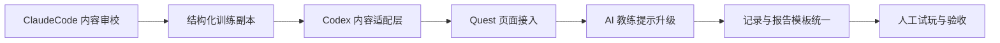

# 14 数模闯关训练营下一阶段分工计划

日期：2026-05-25

## 一、阶段目标

下一阶段主题：**内容接入 + AI 教练升级 + 可试用闭环打磨**。

当前第一版已经跑通 `/quest` 闯关主流程、案例入口、草稿保存、学习记录、工作台预填和基础测试。下一阶段不再扩张新模块，重点把 ClaudeCode 已经产出的教学内容真正接进前端，让用户从“看见 7 关框架”进入“每个案例都有具体训练脚本、提示词和可保存报告”的体验。

一句话目标：

> 把 7 关闯关从通用壳子，升级成 3 个可真实试玩的训练副本。

## 二、当前基线

### 已完成

- `/quest` 闯关页面可用。
- 案例详情页可进入 `/quest?case=<slug>`。
- 7 关定义、进度、解锁、草稿保存已实现。
- 通关报告已支持完整保存到学习记录。
- 草稿加载已补齐缺失关卡和通关条件。
- 大型资料目录已被 `.gitignore` 忽略。
- 前端测试、构建、后端 Python 编译通过。

### 已有内容资产

- `docs/content/quest_stage_templates.md`
- `docs/content/quest_case_scripts.md`
- `docs/content/quest_ai_coach_prompts.md`
- `docs/content/model_method_cards_quest.md`
- `docs/content/quest_problem_bank.md`
- `docs/content/quest_report_template.md`
- `docs/content/quest_home_copy_options.md`
- `docs/content/quest_story_layer_later.md`

这些内容不需要重写，下一阶段要做的是：**审校、结构化、产品化接入**。

## 三、阶段范围

### 进入本阶段

- 3 个优先案例的 7 关 seed 内容接入。
- 每关显示案例定制任务、常见错误、产物示例。
- AI 教练提示从通用静态提示升级为“按关卡 + 模式 + 当前答案”的提示模板。
- 模型选择关接入模型方法卡。
- 通关报告按内容模板生成更完整结构。
- 首页和案例详情页增加“训练副本”入口提示。
- 增加“继续上次闯关”提示。
- 增加内容质量与合规检查文档。

### 不进入本阶段

- 登录、数据库、云端同步。
- 排行榜、金币、称号。
- 大规模题库。
- 自动搜索数据。
- 在线运行任意代码。
- 整篇论文生成或论文润色。
- 重剧情、Boss 战、地图冒险。

## 四、工作流总览

## 五、分工

### Codex 负责：工程接入与验证

1. **建立内容适配层**
   - 从 `docs/content/quest_case_scripts.md` 提炼结构。
   - 新增前端可消费的数据结构，例如 `frontend/src/quest/scripts.ts`。
   - 以 `caseSlug + stageId` 查找案例定制内容。
   - 保持无后端数据库依赖。

2. **升级 `/quest` 页面**
   - 当前关卡显示案例定制任务。
   - 增加“常见错误”“产物示例”“学生必须自己完成”的折叠区。
   - 默认示例题继续可用。
   - 案例内容缺失时回退通用关卡内容。

3. **升级 AI 教练面板**
   - 按 `stageId + coachMode` 选择提示模板。
   - 三种模式保持：提示一下、举个例子、检查答案。
   - 第一轮可以先做“复制提示词/本地提示卡”，不急于直接调用后端。
   - 所有输出仍强调学习辅助边界。

4. **接入模型方法卡**
   - 在第 4 关“模型选择”展示候选模型卡。
   - 展示适用条件、数据要求、常见误用、验证方式。
   - 不替用户做最终选择，只辅助比较。

5. **统一通关报告**
   - 前端生成报告时采用 `quest_report_template.md` 的结构。
   - 报告包含每关答案、AI 使用记录、人工确认、剩余工作。
   - 保持 `fullReport` 完整保存。

6. **测试与验收**
   - 为内容适配层写单元测试。
   - 为案例闯关页写页面测试。
   - 检查默认题、案例题、草稿恢复、报告保存。
   - 每轮改动后跑 `npm test`、`npm run build`。

### ClaudeCode 负责：内容质检与结构化

1. **审校已有内容**
   - 检查 7 关模板、3 个案例脚本、AI 提示词、模型卡是否互相对齐。
   - 找出缺失、重复、过长、过像论文答案的内容。
   - 输出一份内容审校报告。

2. **生成产品可接入的内容矩阵**
   - 把 3 个案例拆成 `caseSlug × stageId` 的矩阵。
   - 每格包含：任务摘要、学生输入引导、AI 提示、常见错误、通关产物示例、合规提醒。
   - 内容必须短，可直接放进前端卡片。

3. **整理提示词包**
   - 按 7 关 × 3 模式整理提示词。
   - 给每条提示词稳定 ID。
   - 明确输入变量和输出格式。
   - 给 Codex 一份可直接映射到前端的数据表。

4. **精修模型选择材料**
   - 把模型方法卡压缩成“前端卡片版”。
   - 每张卡保留：适用场景、输入数据、输出结果、常见误用、验证方法、新手判断问题。

5. **补文案与验收样例**
   - 写通关反馈短句。
   - 写“继续上次闯关”的提示文案。
   - 写 3 个案例的理想通关报告样例大纲。

### 用户负责：方向与验收

1. 确认 3 个优先试玩案例是否仍为：
   - 共享单车需求预测与调度。
   - 熵权 TOPSIS 综合评价。
   - 优化调度/资源分配。
2. 试玩 `/quest` 的 1 个完整案例。
3. 判断文案是否“有闯关感但不幼稚”。
4. 决定下一阶段是否加轻量徽章或阶段反馈。

## 六、推荐执行顺序

### 第 0 步：收口当前修复

- 复查 ClaudeCode 最近修复。
- 将 `.gitignore`、完整报告、草稿归一化等改动提交。
- 作为第二阶段基线。

### 第 1 步：ClaudeCode 内容结构化

- 先做内容审校报告。
- 再做 3 个案例的结构化内容矩阵。
- 再做 AI 教练提示词包 v2。
- 最后做模型卡前端版。

### 第 2 步：Codex 接内容适配层

- 写数据类型和 lookup 函数。
- 加单元测试。
- 不先改 UI，先确保内容能被稳定读取。

### 第 3 步：Codex 改 `/quest` 展示

- 接入案例定制任务。
- 接入常见错误和产物示例。
- 接入模型选择卡。
- 增加继续闯关提示。

### 第 4 步：Codex 改报告和记录

- 用统一模板生成通关报告。
- 确认报告导出不丢内容。
- 增加页面测试。

### 第 5 步：人工试玩与修订

- 选 1 个案例完整走完 7 关。
- 记录卡住点。
- 修文案、提示和 UI 密度。

## 七、验收标准

### 功能验收

- [ ] 3 个案例都能进入专属 7 关训练。
- [ ] 每关至少显示 1 个案例定制任务、1 组输入引导、1 组常见错误。
- [ ] AI 教练三种模式都能按当前关卡输出对应提示。
- [ ] 第 4 关能展示模型方法卡。
- [ ] 通关报告包含 7 关答案、AI 使用记录、人工确认和剩余工作。
- [ ] 旧草稿兼容，不因内容结构变化崩溃。

### 内容验收

- [ ] 内容不出现保奖、一键论文、降 AIGC、直接提交等风险表达。
- [ ] 产物示例只给结构和短句，不写成论文段落。
- [ ] 每关都要求用户写自己的判断。
- [ ] 案例内容够短，适合放到前端任务卡，不把页面压成大段阅读。

### 技术验收

- [ ] `npm test` 通过。
- [ ] `npm run build` 通过。
- [ ] `python -m compileall backend/app` 通过。
- [ ] 至少新增内容适配层单元测试。
- [ ] 至少新增 1 个案例闯关页面测试。

## 八、下一阶段结束时应交付

- 3 个可试玩的案例训练副本。
- 结构化内容适配层。
- 升级后的 `/quest` 页面。
- 可复制或可展示的 AI 教练提示词。
- 模型选择关卡卡片。
- 完整通关报告导出。
- 一份人工试玩记录。
- 一份第三阶段建议：是否加轻量徽章、剧情包装或真实 AI 教练调用。

